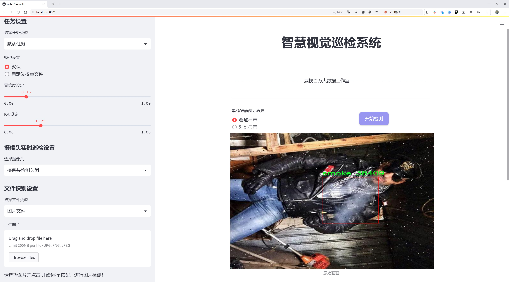
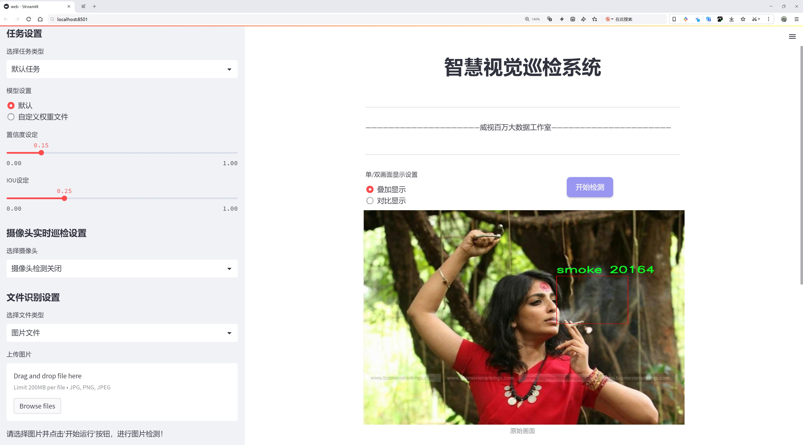
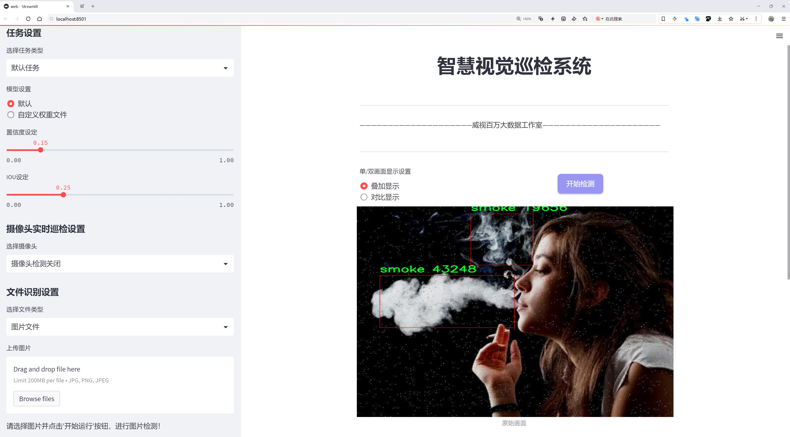
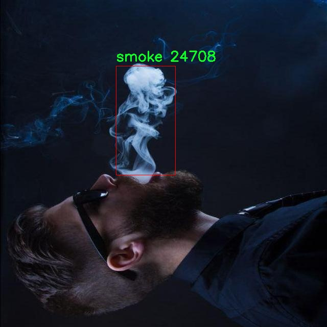
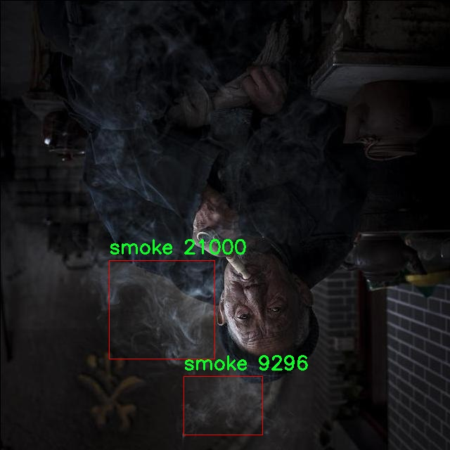
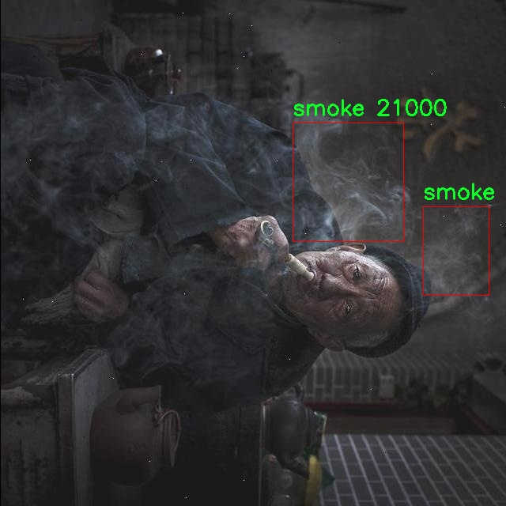
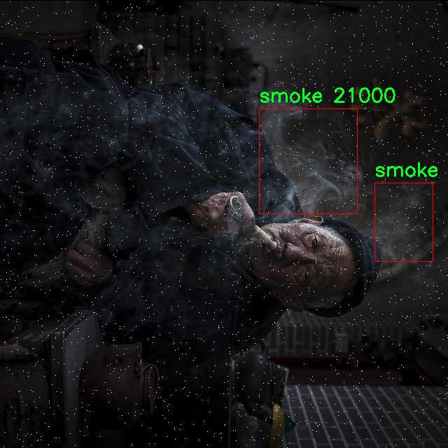
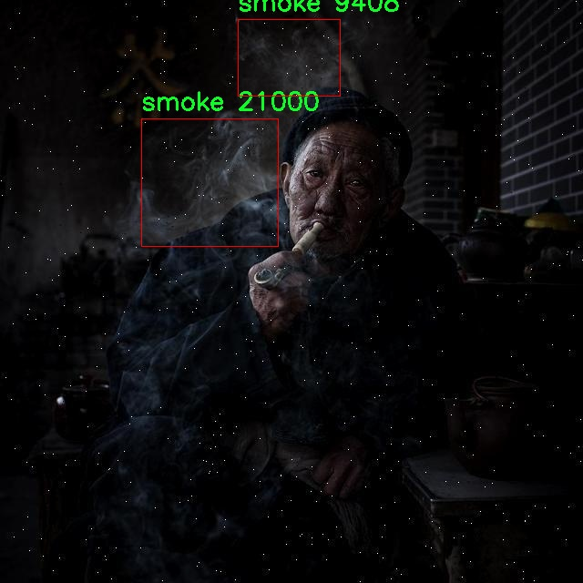

# 烟雾检测与吸烟行为识别检测系统源码分享
 # [一条龙教学YOLOV8标注好的数据集一键训练_70+全套改进创新点发刊_Web前端展示]

### 1.研究背景与意义

项目参考[AAAI Association for the Advancement of Artificial Intelligence](https://gitee.com/qunmasj/projects)

项目来源[AACV Association for the Advancement of Computer Vision](https://kdocs.cn/l/cszuIiCKVNis)

研究背景与意义

随着社会经济的快速发展和城市化进程的加快，吸烟行为的普遍性及其对公共健康的影响日益引起人们的关注。吸烟不仅对吸烟者本人造成严重的健康危害，还对周围人群，尤其是儿童和孕妇，构成了二手烟的威胁。因此，开发有效的烟雾检测与吸烟行为识别系统，成为了公共健康领域亟待解决的重要课题。传统的烟雾检测方法多依赖于人工监测和环境监测设备，存在响应速度慢、准确性不足等问题。随着计算机视觉和深度学习技术的迅猛发展，基于图像识别的烟雾检测与吸烟行为识别系统逐渐成为研究热点。

本研究基于改进的YOLOv8模型，旨在构建一个高效、准确的烟雾检测与吸烟行为识别系统。YOLO（You Only Look Once）系列模型以其实时性和高效性在目标检测领域取得了显著的成果。YOLOv8作为最新版本，进一步提升了检测精度和速度，适合在复杂环境中进行实时监测。通过对YOLOv8模型的改进，我们可以更好地适应烟雾和吸烟行为的特征，从而提高系统的整体性能。

本研究所使用的数据集“smoke detection1”包含2900张图像，涵盖了三个主要类别：香烟、面部吸烟和烟雾。这些数据不仅为模型的训练提供了丰富的样本，还为后续的模型评估和验证奠定了基础。通过对这些类别的深入分析，我们可以提取出吸烟行为的特征信息，并将其应用于模型的训练过程中。数据集的多样性和丰富性将有助于提高模型在实际应用中的泛化能力，确保其在不同场景下的有效性。

本研究的意义不仅在于技术层面的创新，更在于其对公共健康的积极影响。通过建立一个高效的烟雾检测与吸烟行为识别系统，我们可以实现对公共场所吸烟行为的实时监控，及时发现并制止不当吸烟行为，从而保护公众的健康。此外，该系统还可以为政策制定者提供数据支持，帮助其制定更为科学的控烟政策和措施，推动社会对吸烟危害的认知。

综上所述，基于改进YOLOv8的烟雾检测与吸烟行为识别系统的研究，不仅具有重要的学术价值，还有助于提升公共健康水平，推动社会对吸烟问题的重视。随着研究的深入，期望能够为烟雾检测技术的发展提供新的思路和方法，为实现无烟环境的目标贡献力量。

### 2.图片演示







##### 注意：由于此博客编辑较早，上面“2.图片演示”和“3.视频演示”展示的系统图片或者视频可能为老版本，新版本在老版本的基础上升级如下：（实际效果以升级的新版本为准）

  （1）适配了YOLOV8的“目标检测”模型和“实例分割”模型，通过加载相应的权重（.pt）文件即可自适应加载模型。

  （2）支持“图片识别”、“视频识别”、“摄像头实时识别”三种识别模式。

  （3）支持“图片识别”、“视频识别”、“摄像头实时识别”三种识别结果保存导出，解决手动导出（容易卡顿出现爆内存）存在的问题，识别完自动保存结果并导出到tempDir中。

  （4）支持Web前端系统中的标题、背景图等自定义修改，后面提供修改教程。

  另外本项目提供训练的数据集和训练教程,暂不提供权重文件（best.pt）,需要您按照教程进行训练后实现图片演示和Web前端界面演示的效果。

### 3.视频演示

[3.1 视频演示](https://www.bilibili.com/video/BV1iAs6e8E2e/)

### 4.数据集信息展示

##### 4.1 本项目数据集详细数据（类别数＆类别名）

nc: 3
names: ['cigarette', 'face-cigarette-smoking', 'smoke']


##### 4.2 本项目数据集信息介绍

数据集信息展示

在本研究中，我们使用了名为“smoke detection1”的数据集，以支持改进YOLOv8模型在烟雾检测与吸烟行为识别系统中的应用。该数据集专门设计用于识别与吸烟相关的多种行为和物体，具有丰富的多样性和高质量的标注信息，为模型的训练提供了坚实的基础。

“smoke detection1”数据集包含三类主要对象，分别是“cigarette”（香烟）、“face-cigarette-smoking”（面部吸烟行为）和“smoke”（烟雾）。这三类对象的选择不仅涵盖了吸烟行为的直接表现，还包括了与吸烟相关的环境因素，从而使得模型能够更全面地理解和识别吸烟行为及其影响。数据集中每一类的样本均经过精心挑选和标注，确保了数据的准确性和代表性。

在数据集的构建过程中，研究团队注重了样本的多样性，确保不同场景、不同角度以及不同光照条件下的图像均被纳入考量。这种多样性使得模型在实际应用中能够更好地适应各种复杂的环境，提升了其鲁棒性和准确性。例如，在“cigarette”类别中，数据集不仅包含了香烟的特写图像，还包括了香烟在不同手势和动作下的表现，这为模型提供了更丰富的上下文信息。在“face-cigarette-smoking”类别中，数据集收录了多种人群的吸烟行为，涵盖了不同性别、年龄和种族的个体，进一步增强了模型的泛化能力。而在“smoke”类别中，数据集则包含了多种烟雾的表现形式，如室内外环境中的烟雾扩散情况，这对于模型理解烟雾的形成和传播具有重要意义。

此外，数据集的标注过程采用了先进的图像标注工具，确保每一张图像的标注都经过严格审核，最大限度地减少了标注错误的可能性。每个类别的样本数量均衡，保证了模型在训练过程中不会因类别不平衡而导致的偏差，从而提升了模型的学习效果和最终的识别准确率。

通过对“smoke detection1”数据集的深入分析和利用，我们期望能够显著提升YOLOv8在烟雾检测与吸烟行为识别方面的性能。这一数据集不仅为研究提供了丰富的训练样本，也为后续的模型优化和应用奠定了坚实的基础。随着对该数据集的不断深入研究，我们相信能够在烟雾检测和吸烟行为识别领域取得更为显著的进展，为公共健康和环境保护提供有力的技术支持。











### 5.全套项目环境部署视频教程（零基础手把手教学）

[5.1 环境部署教程链接（零基础手把手教学）](https://www.ixigua.com/7404473917358506534?logTag=c807d0cbc21c0ef59de5)


[5.2 安装Python虚拟环境创建和依赖库安装视频教程链接（零基础手把手教学）](https://www.ixigua.com/7404474678003106304?logTag=1f1041108cd1f708b01a)

### 6.手把手YOLOV8训练视频教程（零基础小白有手就能学会）

[6.1 手把手YOLOV8训练视频教程（零基础小白有手就能学会）](https://www.ixigua.com/7404477157818401292?logTag=d31a2dfd1983c9668658)

### 7.70+种全套YOLOV8创新点代码加载调参视频教程（一键加载写好的改进模型的配置文件）

[7.1 70+种全套YOLOV8创新点代码加载调参视频教程（一键加载写好的改进模型的配置文件）](https://www.ixigua.com/7404478314661806627?logTag=29066f8288e3f4eea3a4)

### 8.70+种全套YOLOV8创新点原理讲解（非科班也可以轻松写刊发刊，V10版本正在科研待更新）

由于篇幅限制，每个创新点的具体原理讲解就不一一展开，具体见下列网址中的创新点对应子项目的技术原理博客网址【Blog】：


[8.1 70+种全套YOLOV8创新点原理讲解链接](https://gitee.com/qunmasj/good)

### 9.系统功能展示（检测对象为举例，实际内容以本项目数据集为准）

图9.1.系统支持检测结果表格显示

  图9.2.系统支持置信度和IOU阈值手动调节

  图9.3.系统支持自定义加载权重文件best.pt(需要你通过步骤5中训练获得)

  图9.4.系统支持摄像头实时识别

  图9.5.系统支持图片识别

  图9.6.系统支持视频识别

  图9.7.系统支持识别结果文件自动保存

  图9.8.系统支持Excel导出检测结果数据


### 10.原始YOLOV8算法原理

原始YOLOv8算法原理

YOLOv8算法是Ultralytics公司在2023年推出的目标检测模型，作为YOLO系列的最新版本，它在前几代的基础上进行了显著的改进和创新。YOLOv8不仅在检测精度和速度上实现了长足的进步，还在网络结构和训练策略上进行了深度优化，使其在多种应用场景中表现出色。YOLOv8的设计理念是快速、准确且易于使用，这使得它成为目标检测、图像分割和图像分类等任务的理想选择。

YOLOv8的网络结构主要由输入层、主干网络、颈部网络和头部网络四个部分组成。输入层的设计尤为重要，YOLOv8默认的输入图像尺寸为640x640，但为了适应不同长宽比的图像，算法采用了自适应图片缩放的策略。这种方法通过将图像的长边按比例缩小到指定尺寸，然后对短边进行填充，最大限度地减少了信息冗余，从而提高了目标检测和推理的速度。此外，在训练过程中，YOLOv8引入了Mosaic数据增强技术，通过随机选择四张图像进行缩放和拼接，生成新的训练样本。这种增强方式不仅提高了模型的泛化能力，还有效提升了预测精度。

在主干网络部分，YOLOv8的设计借鉴了YOLOv7中的ELAN模块，将YOLOv5中的C3模块替换为C2F模块。C2F模块通过并行的梯度流分支，增强了特征提取的能力，使得模型在保持轻量化的同时，能够获得更丰富的梯度信息，从而提高了检测精度。与传统的C3模块相比，C2F模块在结构上更加灵活，能够适应不同规模的模型需求。此外，YOLOv8在主干网络的末尾引入了空间金字塔池化（SPPF）结构，通过多尺度的最大池化操作，进一步增强了网络的特征抽象能力。

颈部网络部分则采用了路径聚合网络（PAN）结构，旨在加强不同尺度特征的融合能力。通过对来自主干网络不同阶段的特征图进行有效的聚合，YOLOv8能够更好地捕捉到不同尺寸目标的特征信息，从而提升整体检测性能。这一设计理念使得YOLOv8在处理复杂场景时，能够更好地适应多样化的目标。

在头部网络方面，YOLOv8的创新之处在于将原有的耦合头结构转变为解耦头结构。传统的耦合头将检测和分类任务合并在同一个卷积层中进行处理，而YOLOv8则通过两个独立的卷积分支分别处理类别预测和边界框回归。这种解耦设计不仅提高了模型的灵活性，还优化了损失函数的计算。在损失函数的设计上，YOLOv8摒弃了传统的对象分支，采用了基于二元交叉熵损失（BCELoss）和分布焦点损失（DFLoss）结合完全交并比损失（CIOULoss）的策略。这一改进使得模型在训练过程中能够更快地聚焦于标签附近的数值，从而提高了边界框预测的准确性。

YOLOv8还在目标检测的策略上进行了革命性的改变，摒弃了以往的Anchor-Based方法，转而采用Anchor-Free的策略。这一转变使得YOLOv8在目标检测时不再依赖于预设的锚框，而是将目标检测问题转化为关键点检测。这种方法不仅简化了模型结构，还提高了模型的泛化能力，使其在处理不同数据集时表现得更加灵活。

综上所述，YOLOv8通过在网络结构、训练策略和目标检测方法上的一系列创新，极大地提升了目标检测的性能。其自适应的输入处理、丰富的特征提取能力、有效的特征融合策略以及灵活的检测头设计，使得YOLOv8在多种应用场景中都能实现快速、准确的目标检测。这些改进不仅为研究人员提供了更强大的工具，也为实际应用中的目标检测任务提供了新的解决方案。随着YOLOv8的广泛应用，目标检测技术的未来将更加光明。


### 11.项目核心源码讲解（再也不用担心看不懂代码逻辑）

#### 11.1 code\ultralytics\utils\callbacks\raytune.py

以下是代码的核心部分，并附上详细的中文注释：

```python
# 导入Ultralytics YOLO所需的设置
from ultralytics.utils import SETTINGS

# 尝试导入Ray和Tune库，如果导入失败或设置未启用，则将tune设置为None
try:
    assert SETTINGS["raytune"] is True  # 验证Ray Tune集成是否启用
    import ray
    from ray import tune
    from ray.air import session
except (ImportError, AssertionError):
    tune = None  # 如果导入失败或设置未启用，则tune为None

def on_fit_epoch_end(trainer):
    """在每个训练周期结束时，将训练指标发送到Ray Tune。"""
    if ray.tune.is_session_enabled():  # 检查Ray Tune会话是否启用
        metrics = trainer.metrics  # 获取当前训练指标
        metrics["epoch"] = trainer.epoch  # 将当前周期数添加到指标中
        session.report(metrics)  # 向Ray Tune报告当前指标

# 定义回调函数，如果tune可用，则包含on_fit_epoch_end回调
callbacks = (
    {
        "on_fit_epoch_end": on_fit_epoch_end,  # 训练周期结束时的回调
    }
    if tune  # 如果tune不为None，则添加回调
    else {}
)
```

### 代码分析
1. **导入设置**：从`ultralytics.utils`导入`SETTINGS`，用于获取配置信息。
2. **尝试导入Ray**：通过`try`语句导入Ray库及其相关模块，并检查`SETTINGS`中是否启用了Ray Tune集成。
3. **定义回调函数**：`on_fit_epoch_end`函数在每个训练周期结束时被调用，用于将训练的指标（如损失、准确率等）发送到Ray Tune，以便进行超参数调优。
4. **回调配置**：根据`tune`是否可用，定义一个包含回调函数的字典，供训练过程使用。

这个代码片段的核心功能是将训练过程中的指标报告给Ray Tune，以便进行性能监控和超参数优化。

这个文件是Ultralytics YOLO项目中的一个回调模块，主要用于与Ray Tune集成，以便在训练过程中监控和报告训练指标。首先，文件引入了`SETTINGS`配置，以检查Ray Tune的集成是否被启用。如果集成被启用，程序会尝试导入Ray库及其tune模块和session模块。如果导入失败或集成未启用，则`tune`会被设置为`None`。

接下来，定义了一个名为`on_fit_epoch_end`的函数，该函数在每个训练周期结束时被调用。函数的主要功能是将训练指标发送到Ray Tune。具体来说，如果Ray Tune的会话已启用，函数会从训练器中获取当前的训练指标，并将当前的周期数添加到指标中，然后通过`session.report(metrics)`将这些指标报告给Ray Tune。

最后，文件定义了一个`callbacks`字典，其中包含了`on_fit_epoch_end`回调函数，前提是`tune`模块成功导入并可用。如果`tune`不可用，则`callbacks`将是一个空字典。这种设计使得代码在没有Ray Tune支持的情况下仍然可以正常运行，而不会导致错误。总的来说，这个文件的目的是增强训练过程的可监控性和可调优性。

#### 11.2 ui.py

```python
import sys
import subprocess

def run_script(script_path):
    """
    使用当前 Python 环境运行指定的脚本。

    Args:
        script_path (str): 要运行的脚本路径

    Returns:
        None
    """
    # 获取当前 Python 解释器的路径
    python_path = sys.executable

    # 构建运行命令
    command = f'"{python_path}" -m streamlit run "{script_path}"'

    # 执行命令
    result = subprocess.run(command, shell=True)
    if result.returncode != 0:
        print("脚本运行出错。")


# 实例化并运行应用
if __name__ == "__main__":
    # 指定您的脚本路径
    script_path = "web.py"  # 这里可以直接指定脚本路径

    # 运行脚本
    run_script(script_path)
```

### 代码注释说明：

1. **导入模块**：
   - `import sys`：导入系统模块，用于获取当前 Python 解释器的路径。
   - `import subprocess`：导入子进程模块，用于在新的进程中执行命令。

2. **定义函数 `run_script`**：
   - 函数接收一个参数 `script_path`，表示要运行的 Python 脚本的路径。
   - 使用 `sys.executable` 获取当前 Python 解释器的路径，以确保使用相同的环境来运行脚本。
   - 构建一个命令字符串，使用 `streamlit` 模块运行指定的脚本。
   - 使用 `subprocess.run` 执行构建的命令。如果返回码不为 0，表示脚本运行出错，打印错误信息。

3. **主程序入口**：
   - 使用 `if __name__ == "__main__":` 确保该代码块仅在直接运行该脚本时执行。
   - 指定要运行的脚本路径（这里是 `web.py`）。
   - 调用 `run_script` 函数来执行指定的脚本。

这个程序文件的主要功能是使用当前的 Python 环境来运行一个指定的脚本，具体来说是一个名为 `web.py` 的脚本。程序首先导入了必要的模块，包括 `sys`、`os` 和 `subprocess`，以及一个自定义的路径处理模块 `abs_path`。

在 `run_script` 函数中，首先获取当前 Python 解释器的路径，这通过 `sys.executable` 实现。接着，构建一个命令字符串，这个命令使用 `streamlit` 来运行指定的脚本。命令的格式是将 Python 解释器的路径与 `-m streamlit run` 和脚本路径组合在一起。

随后，使用 `subprocess.run` 来执行这个命令。这个函数会在一个新的 shell 中运行命令，并返回一个结果对象。通过检查 `result.returncode`，程序可以判断脚本是否成功运行。如果返回码不为 0，表示运行过程中出现了错误，此时会打印出“脚本运行出错”的提示信息。

在文件的最后部分，使用 `if __name__ == "__main__":` 语句来确保只有在直接运行该文件时才会执行后面的代码。这里指定了要运行的脚本路径，即 `web.py`，并调用 `run_script` 函数来执行它。

总的来说，这个程序的作用是简化通过 `streamlit` 运行 Python 脚本的过程，提供了一种方便的方式来启动和管理基于 `streamlit` 的应用。

#### 11.3 70+种YOLOv8算法改进源码大全和调试加载训练教程（非必要）\ultralytics\models\sam\modules\encoders.py

以下是经过简化和注释的核心代码部分，主要保留了 `ImageEncoderViT` 类及其相关的关键功能：

```python
import torch
import torch.nn as nn
from typing import Optional, Tuple, Type

class ImageEncoderViT(nn.Module):
    """
    使用视觉变换器（ViT）架构对图像进行编码，将图像编码为紧凑的潜在空间。
    """

    def __init__(
            self,
            img_size: int = 1024,  # 输入图像的尺寸
            patch_size: int = 16,   # 图像切片的尺寸
            in_chans: int = 3,      # 输入图像的通道数
            embed_dim: int = 768,   # 切片嵌入的维度
            depth: int = 12,        # ViT的深度（层数）
            num_heads: int = 12,    # 每个ViT块中的注意力头数
            out_chans: int = 256,   # 输出通道数
            norm_layer: Type[nn.Module] = nn.LayerNorm,  # 归一化层
            act_layer: Type[nn.Module] = nn.GELU,         # 激活函数
    ) -> None:
        """
        初始化参数
        """
        super().__init__()
        self.img_size = img_size

        # 初始化图像切片嵌入模块
        self.patch_embed = PatchEmbed(
            kernel_size=(patch_size, patch_size),
            stride=(patch_size, patch_size),
            in_chans=in_chans,
            embed_dim=embed_dim,
        )

        # 初始化Transformer块
        self.blocks = nn.ModuleList()
        for _ in range(depth):
            block = Block(
                dim=embed_dim,
                num_heads=num_heads,
                norm_layer=norm_layer,
                act_layer=act_layer,
            )
            self.blocks.append(block)

        # 初始化颈部模块（用于进一步处理输出）
        self.neck = nn.Sequential(
            nn.Conv2d(embed_dim, out_chans, kernel_size=1, bias=False),
            norm_layer(out_chans),
            nn.Conv2d(out_chans, out_chans, kernel_size=3, padding=1, bias=False),
            norm_layer(out_chans),
        )

    def forward(self, x: torch.Tensor) -> torch.Tensor:
        """
        处理输入，通过切片嵌入、位置嵌入、Transformer块和颈部模块。
        """
        x = self.patch_embed(x)  # 将输入图像切片并嵌入
        for blk in self.blocks:   # 通过每个Transformer块
            x = blk(x)
        return self.neck(x.permute(0, 3, 1, 2))  # 调整维度并通过颈部模块

class PatchEmbed(nn.Module):
    """图像到切片嵌入的转换。"""

    def __init__(
            self,
            kernel_size: Tuple[int, int] = (16, 16),
            stride: Tuple[int, int] = (16, 16),
            in_chans: int = 3,
            embed_dim: int = 768,
    ) -> None:
        """
        初始化切片嵌入模块。
        """
        super().__init__()
        self.proj = nn.Conv2d(in_chans, embed_dim, kernel_size=kernel_size, stride=stride)

    def forward(self, x: torch.Tensor) -> torch.Tensor:
        """通过卷积计算切片嵌入并调整结果张量的维度。"""
        return self.proj(x).permute(0, 2, 3, 1)  # B C H W -> B H W C

class Block(nn.Module):
    """Transformer块，支持窗口注意力和残差传播。"""

    def __init__(
        self,
        dim: int,
        num_heads: int,
        norm_layer: Type[nn.Module] = nn.LayerNorm,
        act_layer: Type[nn.Module] = nn.GELU,
    ) -> None:
        """
        初始化Transformer块。
        """
        super().__init__()
        self.norm1 = norm_layer(dim)  # 第一层归一化
        self.attn = Attention(dim, num_heads=num_heads)  # 注意力机制
        self.norm2 = norm_layer(dim)  # 第二层归一化
        self.mlp = MLPBlock(embedding_dim=dim, mlp_dim=int(dim * 4), act=act_layer)  # MLP模块

    def forward(self, x: torch.Tensor) -> torch.Tensor:
        """执行Transformer块的前向传播。"""
        shortcut = x
        x = self.norm1(x)  # 归一化
        x = self.attn(x)   # 通过注意力机制
        x = shortcut + x   # 残差连接
        return x + self.mlp(self.norm2(x))  # 通过MLP并返回

class Attention(nn.Module):
    """多头注意力块。"""

    def __init__(self, dim: int, num_heads: int = 8) -> None:
        """
        初始化注意力模块。
        """
        super().__init__()
        self.num_heads = num_heads
        self.qkv = nn.Linear(dim, dim * 3)  # 查询、键、值的线性变换
        self.proj = nn.Linear(dim, dim)  # 输出的线性变换

    def forward(self, x: torch.Tensor) -> torch.Tensor:
        """应用注意力机制并返回结果。"""
        B, H, W, _ = x.shape
        qkv = self.qkv(x).reshape(B, H * W, 3, self.num_heads, -1).permute(2, 0, 3, 1, 4)
        q, k, v = qkv.reshape(3, B * self.num_heads, H * W, -1).unbind(0)  # 拆分查询、键、值
        attn = (q @ k.transpose(-2, -1))  # 计算注意力分数
        attn = attn.softmax(dim=-1)  # 归一化
        x = (attn @ v).view(B, self.num_heads, H, W, -1).permute(0, 2, 3, 1, 4).reshape(B, H, W, -1)  # 计算输出
        return self.proj(x)  # 线性变换输出
```

### 代码说明：
1. **ImageEncoderViT**：这是一个使用视觉变换器（ViT）架构的图像编码器。它将输入图像分割成小块（patches），并通过多个Transformer块进行处理，最后通过一个颈部模块生成最终的编码表示。
  
2. **PatchEmbed**：这个模块负责将输入图像切分为小块并进行嵌入，使用卷积操作实现。

3. **Block**：这是Transformer的基本构建块，包含归一化、注意力机制和多层感知机（MLP）。

4. **Attention**：实现了多头注意力机制，计算查询、键、值之间的关系，并生成注意力输出。

通过这些核心部分，模型能够有效地处理和编码图像数据。

这个程序文件是一个实现了图像编码器和提示编码器的PyTorch模块，主要用于YOLOv8算法的改进。文件中定义了多个类，包括`ImageEncoderViT`、`PromptEncoder`、`PositionEmbeddingRandom`、`Block`、`Attention`和`PatchEmbed`，这些类共同构成了一个基于视觉变换器（ViT）架构的图像编码器。

`ImageEncoderViT`类是一个图像编码器，使用ViT架构将输入图像编码为紧凑的潜在空间。它首先将图像分割成小块（patches），然后通过一系列的变换块（transformer blocks）处理这些小块。编码后的小块通过一个“neck”模块进一步处理，以生成最终的编码表示。该类的构造函数接受多个参数，包括输入图像的大小、补丁大小、嵌入维度、深度、注意力头的数量等，允许用户根据需要进行调整。

`PromptEncoder`类用于编码不同类型的提示，包括点、框和掩码，以便输入到掩码解码器中。它生成稀疏和密集的嵌入表示，适用于不同的输入提示。该类的构造函数同样接受多个参数，包括嵌入维度、输入图像大小、掩码通道数等。

`PositionEmbeddingRandom`类实现了基于随机空间频率的位置信息编码。它通过生成一个位置编码矩阵来为输入的点提供位置信息，支持将坐标归一化到[0,1]范围内。

`Block`类表示一个变换器块，支持窗口注意力和残差传播。它包含归一化层、注意力机制和多层感知机（MLP）模块。注意力机制通过计算查询、键和值之间的关系来实现。

`Attention`类实现了多头注意力机制，支持相对位置编码。它通过线性变换生成查询、键和值，并计算注意力分数。

`PatchEmbed`类负责将输入图像转换为补丁嵌入。它使用卷积层将图像分割成补丁，并生成相应的嵌入表示。

整体而言，这个程序文件通过实现这些类，提供了一个灵活且可扩展的框架，用于处理图像编码和提示编码，为YOLOv8算法的改进提供了基础。

#### 11.4 code\ultralytics\models\sam\predict.py

以下是代码中最核心的部分，并附上详细的中文注释：

```python
class Predictor(BasePredictor):
    """
    Predictor类用于Segment Anything Model (SAM)，继承自BasePredictor。

    该类提供了一个接口，用于图像分割任务的模型推理。
    通过先进的架构和可提示的分割能力，它支持灵活的实时掩码生成。
    """

    def __init__(self, cfg=DEFAULT_CFG, overrides=None, _callbacks=None):
        """
        初始化Predictor，配置、覆盖和回调。

        Args:
            cfg (dict): 配置字典。
            overrides (dict, optional): 覆盖默认配置的值字典。
            _callbacks (dict, optional): 自定义行为的回调函数字典。
        """
        if overrides is None:
            overrides = {}
        # 更新配置，设置任务为分割，模式为预测，图像大小为1024
        overrides.update(dict(task="segment", mode="predict", imgsz=1024))
        super().__init__(cfg, overrides, _callbacks)
        self.args.retina_masks = True  # 启用视网膜掩码
        self.im = None  # 输入图像
        self.features = None  # 提取的图像特征
        self.prompts = {}  # 提示集合
        self.segment_all = False  # 是否分割所有对象的标志

    def preprocess(self, im):
        """
        预处理输入图像以进行模型推理。

        Args:
            im (torch.Tensor | List[np.ndarray]): BCHW格式的张量或HWC格式的numpy数组列表。

        Returns:
            (torch.Tensor): 预处理后的图像张量。
        """
        if self.im is not None:
            return self.im  # 如果已经处理过，直接返回
        not_tensor = not isinstance(im, torch.Tensor)  # 检查输入是否为张量
        if not_tensor:
            # 将numpy数组转换为张量
            im = np.stack(self.pre_transform(im))
            im = im[..., ::-1].transpose((0, 3, 1, 2))  # 转换为BCHW格式
            im = np.ascontiguousarray(im)
            im = torch.from_numpy(im)

        im = im.to(self.device)  # 将图像移动到指定设备
        im = im.half() if self.model.fp16 else im.float()  # 根据模型精度转换数据类型
        if not_tensor:
            im = (im - self.mean) / self.std  # 归一化处理
        return im

    def inference(self, im, bboxes=None, points=None, labels=None, masks=None, multimask_output=False, *args, **kwargs):
        """
        基于给定的输入提示执行图像分割推理。

        Args:
            im (torch.Tensor): 预处理后的输入图像张量，形状为(N, C, H, W)。
            bboxes (np.ndarray | List, optional): 边界框，形状为(N, 4)，XYXY格式。
            points (np.ndarray | List, optional): 指示对象位置的点，形状为(N, 2)，像素坐标。
            labels (np.ndarray | List, optional): 点提示的标签，形状为(N, )。1表示前景，0表示背景。
            masks (np.ndarray, optional): 先前预测的低分辨率掩码，形状应为(N, H, W)。对于SAM，H=W=256。
            multimask_output (bool, optional): 返回多个掩码的标志。对模糊提示有帮助。默认为False。

        Returns:
            (tuple): 包含以下三个元素的元组。
                - np.ndarray: 输出掩码，形状为CxHxW，其中C是生成的掩码数量。
                - np.ndarray: 长度为C的数组，包含模型为每个掩码预测的质量分数。
                - np.ndarray: 低分辨率logits，形状为CxHxW，用于后续推理，H=W=256。
        """
        # 如果self.prompts中存储了提示，则覆盖传入的提示
        bboxes = self.prompts.pop("bboxes", bboxes)
        points = self.prompts.pop("points", points)
        masks = self.prompts.pop("masks", masks)

        if all(i is None for i in [bboxes, points, masks]):
            return self.generate(im, *args, **kwargs)  # 如果没有提示，生成掩码

        return self.prompt_inference(im, bboxes, points, labels, masks, multimask_output)  # 使用提示进行推理

    def generate(self, im, crop_n_layers=0, crop_overlap_ratio=512 / 1500, crop_downscale_factor=1, points_stride=32, points_batch_size=64, conf_thres=0.88, stability_score_thresh=0.95, crop_nms_thresh=0.7):
        """
        使用Segment Anything Model (SAM)执行图像分割。

        Args:
            im (torch.Tensor): 输入张量，表示预处理后的图像，维度为(N, C, H, W)。
            crop_n_layers (int): 指定用于图像裁剪的层数。
            crop_overlap_ratio (float): 裁剪之间的重叠比例。
            points_stride (int, optional): 沿图像每一侧采样的点数。
            points_batch_size (int): 同时处理的点的批量大小。
            conf_thres (float): 根据模型的掩码质量预测进行过滤的置信度阈值。
            stability_score_thresh (float): 根据掩码稳定性进行过滤的稳定性阈值。

        Returns:
            (tuple): 包含分割掩码、置信度分数和边界框的元组。
        """
        self.segment_all = True  # 设置为分割所有对象
        ih, iw = im.shape[2:]  # 获取输入图像的高度和宽度
        crop_regions, layer_idxs = generate_crop_boxes((ih, iw), crop_n_layers, crop_overlap_ratio)  # 生成裁剪区域
        pred_masks, pred_scores, pred_bboxes = [], [], []  # 初始化预测结果列表

        for crop_region, layer_idx in zip(crop_regions, layer_idxs):
            x1, y1, x2, y2 = crop_region  # 裁剪区域的坐标
            crop_im = F.interpolate(im[..., y1:y2, x1:x2], (ih, iw), mode="bilinear", align_corners=False)  # 裁剪并插值
            # 进行推理
            crop_masks, crop_scores, crop_bboxes = self.prompt_inference(crop_im, points=points, multimask_output=True)

            # 处理预测结果，进行NMS等后处理
            # ...

        return pred_masks, pred_scores, pred_bboxes  # 返回最终的掩码、分数和边界框
```

### 主要功能说明
1. **Predictor类**：这是一个图像分割模型的推理类，负责初始化、预处理、推理和后处理等功能。
2. **预处理方法**：将输入图像转换为适合模型的格式，并进行归一化处理。
3. **推理方法**：根据输入的提示（如边界框、点等）执行图像分割推理。
4. **生成方法**：实现对整个图像的分割，支持裁剪处理以提高分割精度。

以上是代码的核心部分及其详细注释，涵盖了模型推理的主要流程和功能。

这个程序文件 `predict.py` 是 Ultralytics YOLO 框架的一部分，主要用于实现 Segment Anything Model (SAM) 的图像分割预测功能。SAM 是一种先进的图像分割模型，具有可提示分割和零样本性能等特点。该模块包含了执行分割所需的预测逻辑和辅助工具，旨在高性能、实时地处理图像分割任务。

文件中首先导入了一些必要的库，包括 NumPy、PyTorch 及其功能模块，以及 Ultralytics 框架中的一些工具和方法。接着定义了一个 `Predictor` 类，该类继承自 `BasePredictor`，并提供了一个用于图像分割任务的推理接口。该类支持多种提示类型的输入，如边界框、点和低分辨率掩码，并能够灵活地生成实时掩码。

在 `Predictor` 类的构造函数中，初始化了一些配置参数、回调函数和图像处理的相关属性。它还设置了 `retina_masks` 属性为 `True`，以优化结果。接下来的 `preprocess` 方法用于对输入图像进行预处理，包括应用变换和归一化，支持多种输入格式。

`inference` 方法是进行图像分割推理的核心，接收预处理后的图像及各种提示信息（如边界框、点、掩码等），并根据这些提示调用 `prompt_inference` 方法进行分割。`prompt_inference` 方法内部使用 SAM 的架构来处理提示并生成掩码。

`generate` 方法则用于对整个图像进行分割，支持通过图像裁剪来实现更精细的分割。它通过生成裁剪区域并在每个区域内进行推理，最终合并结果并应用非极大值抑制（NMS）来去除重复的掩码。

此外，`setup_model` 方法用于初始化 SAM 模型，设置设备、图像归一化参数等。`postprocess` 方法则负责对模型的输出进行后处理，生成最终的检测掩码和边界框。

该类还提供了一些辅助方法，如 `set_image` 用于设置单张图像进行推理，`set_prompts` 用于提前设置提示信息，`remove_small_regions` 用于去除小的、不连通的区域和孔洞，并执行 NMS。

总体而言，这个文件实现了一个功能强大的图像分割预测器，能够灵活地处理多种输入并生成高质量的分割结果，适用于实时图像处理任务。

#### 11.5 code\ultralytics\utils\downloads.py

以下是代码中最核心的部分，并附上详细的中文注释：

```python
import requests
from pathlib import Path
from zipfile import ZipFile, is_zipfile
from ultralytics.utils import LOGGER, TQDM

def safe_download(
    url,
    file=None,
    dir=None,
    unzip=True,
    delete=False,
    retry=3,
    min_bytes=1e0,
    exist_ok=False,
    progress=True,
):
    """
    从指定的 URL 下载文件，并可选择解压缩和删除下载的文件。

    参数:
        url (str): 要下载的文件的 URL。
        file (str, optional): 下载文件的文件名。如果未提供，将使用 URL 的文件名。
        dir (str, optional): 保存下载文件的目录。如果未提供，将保存在当前工作目录中。
        unzip (bool, optional): 是否在下载后解压缩文件。默认值为 True。
        delete (bool, optional): 是否在解压缩后删除下载的文件。默认值为 False。
        retry (int, optional): 下载失败时的重试次数。默认值为 3。
        min_bytes (float, optional): 下载文件被视为成功的最小字节数。默认值为 1E0。
        exist_ok (bool, optional): 解压缩时是否覆盖现有内容。默认值为 False。
        progress (bool, optional): 下载过程中是否显示进度条。默认值为 True。

    返回:
        (Path): 下载文件的路径。
    """
    f = Path(dir or ".") / (file or url2file(url))  # 生成文件路径
    if not f.is_file():  # 如果文件不存在
        desc = f"Downloading {url} to '{f}'"
        LOGGER.info(f"{desc}...")  # 记录下载信息
        f.parent.mkdir(parents=True, exist_ok=True)  # 创建目录
        for i in range(retry + 1):  # 尝试下载
            try:
                # 使用 requests 下载文件
                with requests.get(url, stream=True) as response:
                    response.raise_for_status()  # 检查请求是否成功
                    with open(f, "wb") as f_opened:
                        for data in response.iter_content(chunk_size=8192):  # 分块读取
                            f_opened.write(data)  # 写入文件
                if f.exists() and f.stat().st_size > min_bytes:  # 检查文件大小
                    break  # 下载成功
            except Exception as e:
                if i >= retry:  # 超过重试次数
                    raise ConnectionError(f"下载失败: {url}") from e
                LOGGER.warning(f"⚠️ 下载失败，正在重试 {i + 1}/{retry} {url}...")

    # 解压缩文件
    if unzip and f.exists() and f.suffix in (".zip", ".tar", ".gz"):
        unzip_dir = dir or f.parent  # 解压缩目录
        if is_zipfile(f):
            with ZipFile(f) as zipObj:
                zipObj.extractall(unzip_dir)  # 解压缩
        if delete:
            f.unlink()  # 删除 zip 文件
    return f  # 返回下载的文件路径
```

### 代码说明：
1. **导入必要的库**：引入 `requests` 用于下载文件，`Path` 用于处理文件路径，`ZipFile` 用于解压缩文件，以及 `LOGGER` 用于记录日志信息。
  
2. **`safe_download` 函数**：该函数用于从指定的 URL 下载文件，并提供了多个参数来控制下载行为，例如文件名、保存目录、是否解压缩、重试次数等。

3. **文件路径处理**：根据提供的目录和文件名生成完整的文件路径。如果未提供文件名，则从 URL 中提取。

4. **下载文件**：使用 `requests` 库进行文件下载，支持重试机制。下载过程中，分块读取数据并写入文件，以避免内存占用过高。

5. **文件存在性检查**：下载完成后，检查文件是否存在且大小是否符合要求。

6. **解压缩文件**：如果下载的文件是压缩文件（如 `.zip`、`.tar`、`.gz`），则进行解压缩操作。

7. **返回值**：返回下载文件的路径，方便后续使用。

这个程序文件 `downloads.py` 是 Ultralytics YOLO 项目的一部分，主要用于处理文件的下载、解压和相关的文件管理操作。文件中包含了多个函数，每个函数都有特定的功能，下面是对这些功能的详细说明。

首先，文件导入了一些必要的库，包括用于处理文件路径的 `Path`，用于网络请求的 `requests`，以及用于多线程下载的 `ThreadPool`。同时，定义了一些与 GitHub 资源相关的常量，列出了 YOLO 系列模型的文件名，以便后续下载使用。

函数 `is_url` 用于验证给定字符串是否为有效的 URL，并可选择性地检查该 URL 是否在线。它通过解析 URL 并发送请求来确认其有效性。

`delete_dsstore` 函数用于删除指定目录下的 `.DS_Store` 文件，这些文件是 macOS 系统生成的隐藏文件，可能在跨平台文件传输时造成问题。

`zip_directory` 函数将指定目录的内容压缩为 ZIP 文件，支持排除特定文件，并可选择性地显示进度条。它会在压缩前调用 `delete_dsstore` 函数来清理不必要的文件。

`unzip_file` 函数用于解压 ZIP 文件到指定路径，支持排除特定文件，并在解压时检查目标路径是否为空，以避免覆盖已有文件。

`check_disk_space` 函数用于检查下载文件所需的磁盘空间是否充足。它会获取文件的大小并与当前可用空间进行比较，确保在下载前有足够的空间。

`get_google_drive_file_info` 函数用于处理 Google Drive 的分享链接，提取出直接下载链接和文件名，以便后续下载。

`safe_download` 函数是一个通用的下载函数，支持从 URL 下载文件，处理 Google Drive 链接，支持重试机制，并可选择性地解压和删除下载的文件。它会检查文件是否已经存在，并在下载过程中显示进度条。

`get_github_assets` 函数用于从指定的 GitHub 仓库获取发布版本的标签和资产列表，支持获取最新版本的资产。

`attempt_download_asset` 函数尝试从 GitHub 的发布资产中下载指定的文件，如果本地不存在则进行下载。它会检查文件是否已经存在，并根据需要进行下载。

最后，`download` 函数是一个高层次的下载接口，支持从一个或多个 URL 下载文件，支持并发下载、解压和删除 ZIP 文件等功能。它会创建目标目录并处理每个 URL 的下载。

整体来看，这个文件提供了一系列功能强大的工具，旨在简化文件下载和管理的过程，特别是在处理模型和数据集时非常有用。

#### 11.6 train.py

以下是经过简化和注释的核心代码部分，主要集中在 YOLO 检测模型的训练过程：

```python
import random
import numpy as np
import torch.nn as nn
from ultralytics.data import build_dataloader, build_yolo_dataset
from ultralytics.engine.trainer import BaseTrainer
from ultralytics.models import yolo
from ultralytics.nn.tasks import DetectionModel
from ultralytics.utils import LOGGER, RANK
from ultralytics.utils.torch_utils import de_parallel, torch_distributed_zero_first

class DetectionTrainer(BaseTrainer):
    """
    基于检测模型的训练类，继承自 BaseTrainer。
    """

    def build_dataset(self, img_path, mode="train", batch=None):
        """
        构建 YOLO 数据集。

        参数:
            img_path (str): 图像文件夹的路径。
            mode (str): 模式，可以是 'train' 或 'val'，用于自定义不同的增强。
            batch (int, optional): 批量大小，适用于 'rect' 模式。默认为 None。
        """
        gs = max(int(de_parallel(self.model).stride.max() if self.model else 0), 32)
        return build_yolo_dataset(self.args, img_path, batch, self.data, mode=mode, rect=mode == "val", stride=gs)

    def get_dataloader(self, dataset_path, batch_size=16, rank=0, mode="train"):
        """构造并返回数据加载器。"""
        assert mode in ["train", "val"]
        with torch_distributed_zero_first(rank):  # 在分布式训练中，确保数据集只初始化一次
            dataset = self.build_dataset(dataset_path, mode, batch_size)
        shuffle = mode == "train"  # 训练模式下打乱数据
        workers = self.args.workers if mode == "train" else self.args.workers * 2
        return build_dataloader(dataset, batch_size, workers, shuffle, rank)  # 返回数据加载器

    def preprocess_batch(self, batch):
        """对图像批次进行预处理，包括缩放和转换为浮点数。"""
        batch["img"] = batch["img"].to(self.device, non_blocking=True).float() / 255  # 归一化到 [0, 1]
        if self.args.multi_scale:  # 如果启用多尺度训练
            imgs = batch["img"]
            sz = (
                random.randrange(self.args.imgsz * 0.5, self.args.imgsz * 1.5 + self.stride)
                // self.stride
                * self.stride
            )  # 随机选择一个新的尺寸
            sf = sz / max(imgs.shape[2:])  # 计算缩放因子
            if sf != 1:
                ns = [
                    math.ceil(x * sf / self.stride) * self.stride for x in imgs.shape[2:]
                ]  # 计算新的形状
                imgs = nn.functional.interpolate(imgs, size=ns, mode="bilinear", align_corners=False)  # 调整图像大小
            batch["img"] = imgs
        return batch

    def get_model(self, cfg=None, weights=None, verbose=True):
        """返回 YOLO 检测模型。"""
        model = DetectionModel(cfg, nc=self.data["nc"], verbose=verbose and RANK == -1)
        if weights:
            model.load(weights)  # 加载权重
        return model

    def plot_training_samples(self, batch, ni):
        """绘制训练样本及其标注。"""
        plot_images(
            images=batch["img"],
            batch_idx=batch["batch_idx"],
            cls=batch["cls"].squeeze(-1),
            bboxes=batch["bboxes"],
            paths=batch["im_file"],
            fname=self.save_dir / f"train_batch{ni}.jpg",
            on_plot=self.on_plot,
        )
```

### 代码注释说明：
1. **类 `DetectionTrainer`**: 这是一个用于训练 YOLO 检测模型的类，继承自 `BaseTrainer`。
2. **`build_dataset` 方法**: 负责构建 YOLO 数据集，接收图像路径、模式和批量大小作为参数。
3. **`get_dataloader` 方法**: 构造数据加载器，确保在分布式训练中只初始化一次数据集，并根据模式决定是否打乱数据。
4. **`preprocess_batch` 方法**: 对输入的图像批次进行预处理，包括归一化和调整图像大小。
5. **`get_model` 方法**: 返回一个 YOLO 检测模型，并可选择加载预训练权重。
6. **`plot_training_samples` 方法**: 绘制训练样本及其对应的标注信息，便于可视化训练过程中的数据。

以上代码片段和注释涵盖了 YOLO 检测模型训练的核心逻辑和功能。

这个程序文件 `train.py` 是一个用于训练 YOLO（You Only Look Once）目标检测模型的实现，继承自 `BaseTrainer` 类。文件中包含了一系列用于构建数据集、数据加载、预处理、模型设置和训练过程中的可视化功能的方法。

首先，文件导入了一些必要的库和模块，包括数学运算、随机数生成、深度学习框架 PyTorch 的神经网络模块，以及 Ultralytics 提供的相关数据处理和模型训练的工具。

在 `DetectionTrainer` 类中，主要功能包括：

1. **构建数据集**：`build_dataset` 方法用于根据给定的图像路径和模式（训练或验证）构建 YOLO 数据集。该方法会根据模型的步幅（stride）来调整数据集的构建参数。

2. **获取数据加载器**：`get_dataloader` 方法负责创建并返回数据加载器。它会根据模式选择是否打乱数据，并设置工作线程的数量。

3. **预处理批次数据**：`preprocess_batch` 方法对输入的图像批次进行预处理，包括将图像缩放到适当的大小并转换为浮点数格式。该方法还支持多尺度训练，通过随机选择图像大小来增强模型的鲁棒性。

4. **设置模型属性**：`set_model_attributes` 方法用于将数据集的类别数量和名称等信息附加到模型上，以便在训练过程中使用。

5. **获取模型**：`get_model` 方法返回一个 YOLO 检测模型，并可选择加载预训练权重。

6. **获取验证器**：`get_validator` 方法返回一个用于模型验证的检测验证器，能够计算损失并进行模型评估。

7. **损失项标签**：`label_loss_items` 方法用于返回一个包含训练损失项的字典，便于后续的损失分析。

8. **训练进度字符串**：`progress_string` 方法返回一个格式化的字符串，显示训练的进度，包括当前的 epoch、GPU 内存使用情况和损失值等信息。

9. **绘制训练样本**：`plot_training_samples` 方法用于绘制训练样本及其对应的标注信息，帮助可视化训练过程中的数据。

10. **绘制指标**：`plot_metrics` 方法用于从 CSV 文件中绘制训练过程中的指标，生成可视化结果。

11. **绘制训练标签**：`plot_training_labels` 方法用于创建一个带标签的训练图，展示模型在训练数据上的表现。

整体来看，这个文件提供了一个完整的训练框架，涵盖了从数据准备到模型训练和评估的各个环节，适合用于 YOLO 模型的训练和调试。

### 12.系统整体结构（节选）

### 整体功能和构架概括

Ultralytics YOLO 项目是一个用于目标检测和图像分割的深度学习框架，主要基于 YOLO（You Only Look Once）算法。该项目的整体架构包括多个模块和工具，支持模型的训练、推理、数据处理和下载等功能。以下是对各个模块的功能概述：

- **训练模块**：负责模型的训练过程，包括数据集的构建、数据加载、模型初始化和训练进度的监控。
- **推理模块**：实现了图像分割和目标检测的推理功能，支持多种输入提示和后处理操作。
- **编码器模块**：实现了图像和提示的编码功能，使用视觉变换器（ViT）架构进行特征提取。
- **下载工具**：提供了文件下载、解压和管理的功能，支持从 GitHub 和 Google Drive 等平台获取模型和数据集。
- **回调模块**：与 Ray Tune 集成，提供训练过程中的监控和报告功能。

### 文件功能整理表

| 文件路径                                                                                          | 功能描述                                                         |
|---------------------------------------------------------------------------------------------------|------------------------------------------------------------------|
| `code\ultralytics\utils\callbacks\raytune.py`                                                   | 实现与 Ray Tune 的集成，提供训练过程中的回调和监控功能。       |
| `ui.py`                                                                                           | 提供一个简化的接口，通过 `streamlit` 运行指定的 Python 脚本。   |
| `70+种YOLOv8算法改进源码大全和调试加载训练教程（非必要）\ultralytics\models\sam\modules\encoders.py` | 实现图像编码器和提示编码器，支持 SAM 模型的特征提取。          |
| `code\ultralytics\models\sam\predict.py`                                                         | 实现图像分割的推理功能，支持多种输入提示并生成分割掩码。        |
| `code\ultralytics\utils\downloads.py`                                                            | 提供文件下载、解压和管理功能，支持从多个平台获取资源。          |
| `train.py`                                                                                        | 负责模型的训练过程，包括数据集构建、数据加载和训练监控。       |
| `code\ultralytics\models\sam\__init__.py`                                                       | 初始化 SAM 模块，导入相关类和功能。                             |
| `code\ultralytics\trackers\utils\__init__.py`                                                  | 初始化跟踪器工具模块，导入相关功能。                             |
| `70+种YOLOv8算法改进源码大全和调试加载训练教程（非必要）\ultralytics\models\rtdetr\val.py`       | 实现 RTDETR 模型的验证功能，评估模型性能。                      |
| `70+种YOLOv8算法改进源码大全和调试加载训练教程（非必要）\ultralytics\models\yolo\pose\train.py` | 负责 YOLO 姿态估计模型的训练过程。                               |
| `code\ultralytics\models\sam\modules\tiny_encoder.py`                                            | 实现轻量级编码器，适用于资源受限的环境。                         |
| `code\ultralytics\models\fastsam\predict.py`                                                    | 实现 FastSAM 模型的推理功能，优化分割性能。                      |
| `code\ultralytics\models\rtdetr\__init__.py`                                                    | 初始化 RTDETR 模块，导入相关类和功能。                          |

这个表格总结了每个文件的主要功能，展示了 Ultralytics YOLO 项目的模块化设计和功能分布。

注意：由于此博客编辑较早，上面“11.项目核心源码讲解（再也不用担心看不懂代码逻辑）”中部分代码可能会优化升级，仅供参考学习，完整“训练源码”、“Web前端界面”和“70+种创新点源码”以“13.完整训练+Web前端界面+70+种创新点源码、数据集获取”的内容为准。

### 13.完整训练+Web前端界面+70+种创新点源码、数据集获取


# [下载链接：https://mbd.pub/o/bread/ZpuZlZ9r](https://mbd.pub/o/bread/ZpuZlZ9r)